# Predicting Student Dropout and Academic Success: A Replication and Extension of Martins et al. (2021)

This project replicates and extends on analysis from [Martins et al. (2021)](https://www.researchgate.net/publication/351066139_Early_Prediction_of_Student's_Performance_in_Higher_Education_A_Case_Study) on predicting student dropout and academic success using the UCI dataset (id=697). The primary goal is to evaluate how predictive performance changes as a function of variable availability, comparing models trained on pre-enrollment, post-enrollment, and combined feature sets. Additionally, this work introduces a structured modeling pipeline, dimensionality reduction comparisons, and feature attribution analysis to assess both predictive performance and interpretability.

## 1. Environment and Data Access

Environment & dependencies:

`conda create -n uciml python=3.9 numpy pandas matplotlib seaborn scipy scikit-learn imbalanced-learn ucimlrepo`

The dataset was accessed via the [ucimlrepo](https://github.com/uci-ml-repo/ucimlrepo) package [(id=697)](https://archive.ics.uci.edu/dataset/697/predict+students+dropout+and+academic+success):
```
from ucimlrepo import fetch_ucirepo 

predict_students_dropout_and_academic_success = fetch_ucirepo(id=697)
X = predict_students_dropout_and_academic_success.data.features
Y = predict_students_dropout_and_academic_success.data.targets
```

## 2. Variable Classification and Preprocessing

This dataset includes 36 feature variables and 4,424 samples each corresponding to a student. There are four data types, each requiring a different preprocessing treatment:

 - **Continuous**: Z-score normalized via `StandardScaler`
 - **Ordinal**: Z-score normalized via `StandardScaler`, in line with research methodology in the social sciences
 - **Nominal**: One-hot encoded via `OneHotEncoder` (with `drop='if_binary'`, `sparse_output=False`)
 - **Binary**: Untransformed

 A `ColumnTransformer` was used to apply these transformations in parallel and fitted only on training data to prevent data leakage. One-hot encoding was applied to nominal categorical variables to prevent spurious ordinal relationships from influencing the model. Ordinal variables such as parental education levels were StandardScaled rather than one-hot encoded, preserving their implicit ordering.

## 3. Exploratory Analysis

### 3.1 Data Anomaly

PCA applied to the preprocessed feature matrix revealed a cluster of 180 samples isolated far from the rest of the data on PC1, regardless of target class label (Fig 1). These samples were all students in Animation and Multimedia Design (Course 171). Each had zero values across all semester performance variables. Their target label distribution (Dropout: 77, Graduate: 75, Enrolled: 28) is inconsistent with a true academic profile because graduation and continued enrollment without any recorded academic activity is not plausible.

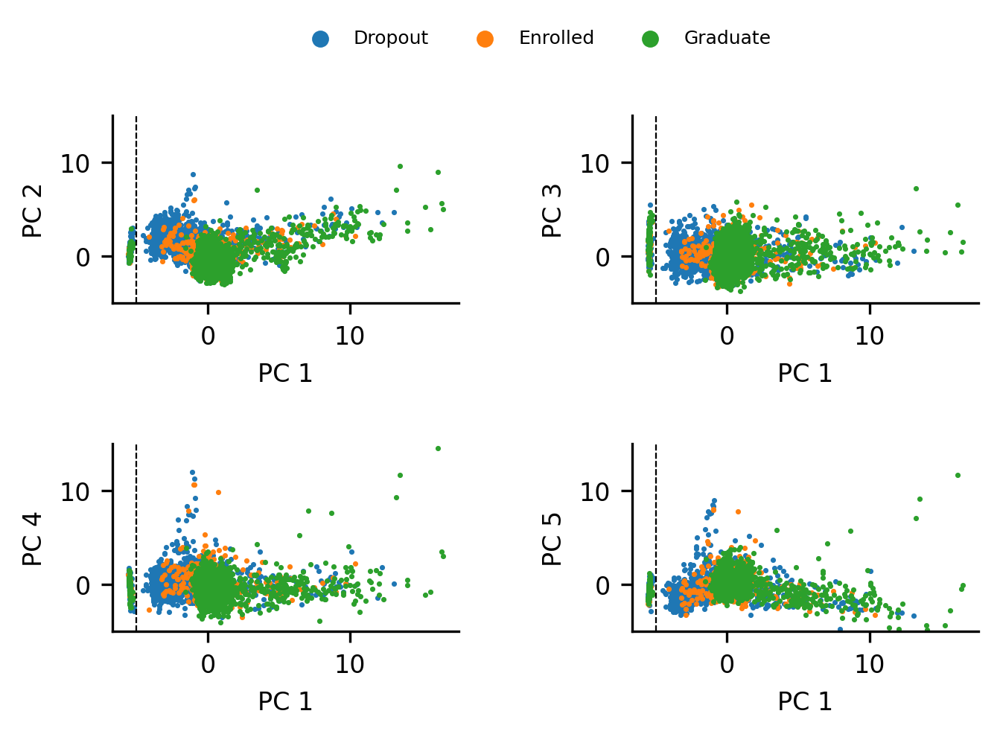
*Fig. 1* (Made in [notebook #1](1_exploratory_data_analysis.ipynb))

These 180 students samples may be due to data linkage failures or a potential full-exemption pathway specific to the major program of the students.

### 3.2 Zero-Inflated Variables

Two zero-inflated variables were identified: `Curricular units 1st sem (credited)` and `Curricular units 2nd sem (credited)`. Approximately 500 samples in each had non-zero values (Fig 2): 

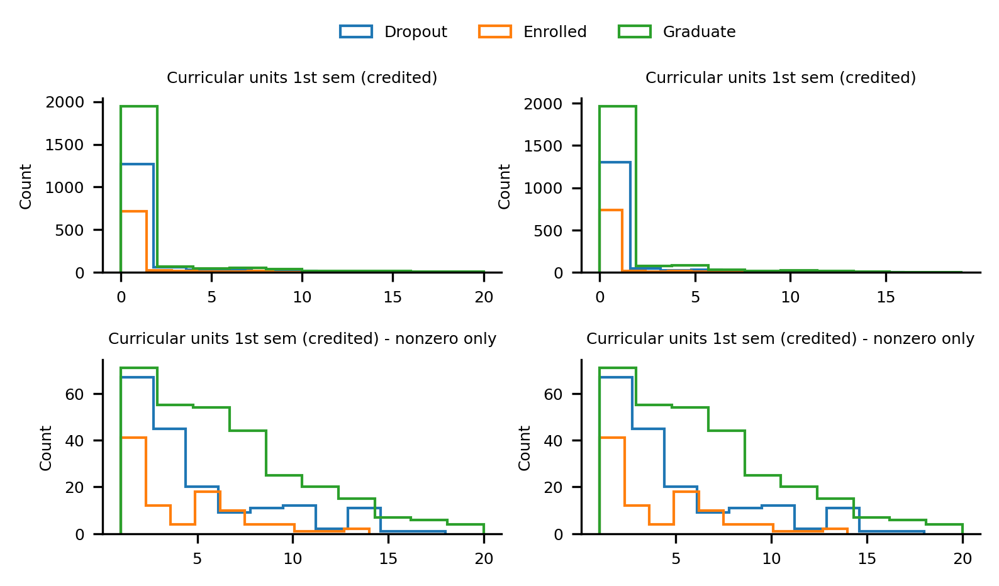
*Fig 2* (Made in notebook #1)

The nonzero values correspond mostly to students who entered via non-traditional pathways: transfers, students over 23, and holders of prior qualifications, who may have carried credits from previous enrollment (Fig 3). The zero values for all remaining students therefore do not represent missing data. 

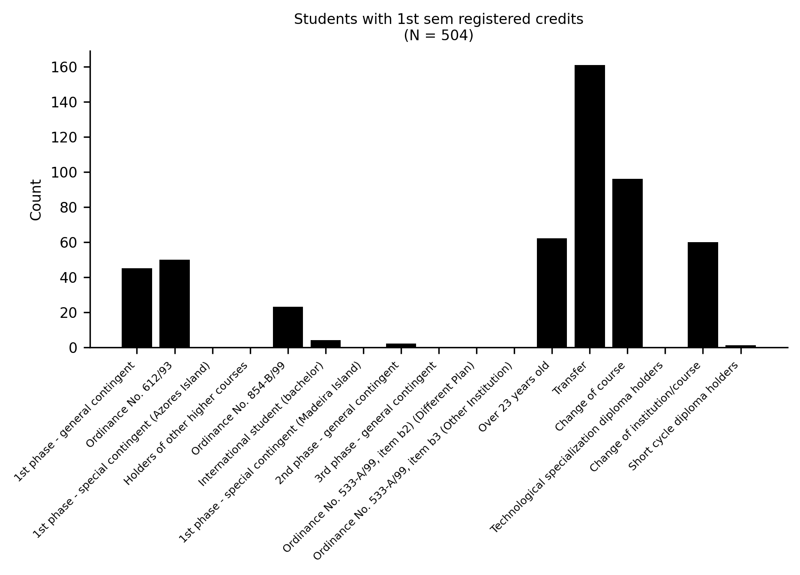
*Fig 3* (Made in [notebook #1](1_exploratory_data_analysis.ipynb))

The zero-inflated variables were kept in the dataset because non-traditional entry students are important samples for a model intended to generalize across all entry pathways.

### 3.3 PCA Structure and Research Questions

PCA identified semester performance variables (units enrolled, credited, approved, and grades across both semesters) as the highest-loading features on PC1, the dimension along which target class clusters are most separated. However, a PCA limited to semester variables alone diminishes this separation, as does a PCA limited to pre-enrollment variables (Fig 4). 

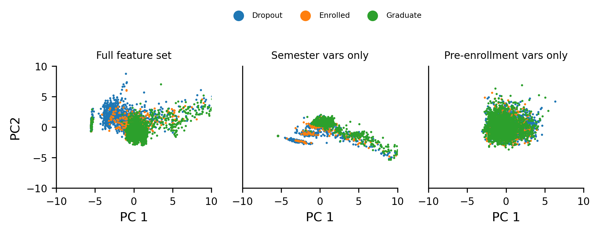
*Fig 4* (Made in [notebook #1](1_exploratory_data_analysis.ipynb))

This suggests that the timing of variable availability (pre-enrollment vs. post-enrollment) drives sample variance that may carry important predictive signal. This observation raised two research questions:

1. How differently will a model trained exclusively on pre-enrollment indicators perform compared to one trained exclusively on post-enrollment indicators?

2. How much predictive accuracy can be gained by combining both indicator sets?

## 4. Three-Model Structure

To address these questions, three models were developed:

| Model | Variables | Samples | Rationale |
|-------|-----------|---------|-----------|
| A | Pre-enrollment only | 4,424 (all) | Early detection: no semester data required |
| B | Post-enrollment only | 4,244 | Semester data only: anomalous Course 171 students excluded |
| C | Combined | 4,244 | Full variable set: anomalous Course 171 students excluded |

The 180 anomalous Course 171 students are retained in Model A because their pre-enrollment data is valid. They were excluded from Models B and C where their zero semester values would introduce noise. Models B and C share the same sample set, ensuring that the comparison between them isolates the contribution of pre-enrollment variables rather than confounding it with sample differences.

A Python script, `fetch_separate_datasets.py` was written to construct these three datasets.

## 5. Class Imbalance and Component Selection

### 5.1 SMOTE

The dataset exhibits class imbalance across the three target categories (Dropout, Enrolled, Graduate). The original paper used Synthetic Minority Oversampling Technique (SMOTE) to address this. In this analysis, SMOTE was also applied; initially to each training set prior to cross-validation to verify it could correctly handle the resampling, and was subsequently applied within each cross-validation fold using an `imbalanced-learn` pipeline to prevent synthetic samples from leaking into validation folds.

### 5.2 Cross decomposition-based dimensionality reduction via Partial Least Squares (PLS)

Partial Least Squares Regression is a linear estimation method with an intermediate dimensionality reduction step extracting latent dimensions that directly covary with the target classes. In later sections, it is compared with PCA, which only maximizes the variance in the independent variables. 

`PLSRegression` is used in `plsda.py` for classification by training on one-hot encoded targets and returning the argmax of the continuous linear predictions. The optimal number of PLS components was determined for each model by fitting with an increasing number of components: up to 100 for Models A and C, and up to 12 for Model B (encompassing all possible components given its reduced feature set) (Fig 5). The F1-macro from prediction on held out data was tracked at each step and the peak of the resulting curve identified the optimal number.

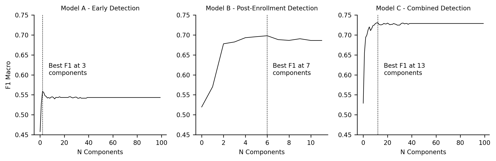
*Fig 5* (Made in [notebook #3](3_PLS_feature_selection.ipynb))

| Model | Variables | Samples | Optimal Components | F1-Macro |
|-------|-----------|---------|-------------------|-------------|
| A | Pre-enrollment only | 4,424 | 3 | ~0.56 |
| B | Post-enrollment only | 4,244 | 7 | ~0.69 |
| C | Combined | 4,244 | 13 | ~0.73 |

The performance progression directly addresses the two research questions: pre-enrollment variables alone perform considerably worse than post-enrollment variables (0.56 vs 0.69), and combining both yields meaningful additional accuracy (0.73 vs 0.69). Models B and C exceed the original paper's XGBoost benchmark of 0.65 using PLSDA alone.

All three models struggled to classify enrolled students, who overlapped substantially with graduates in feature space (Fig 6). This pattern persisted across all models, suggesting temporal ambiguity in the target label. IE: students recorded as "enrolled" had not yet reached a terminal outcome, making their feature profiles indistinguishable from eventual graduates at the time of data collection.

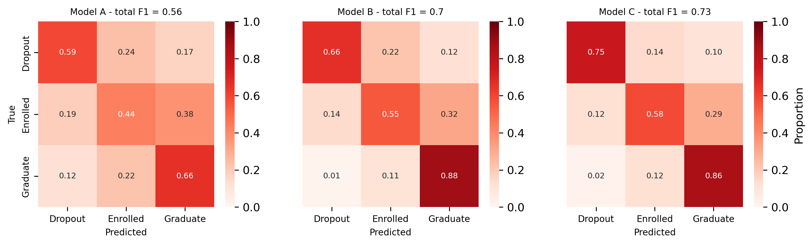
*Fig 6* (Made in [notebook #3](3_PLS_feature_selection.ipynb))

Per-class test set performance for the PLSDA models:

| Class | Model A F1 | Model B F1 | Model C F1 |
|-------|-----------|-----------|-----------|
| Dropout | 0.64 | 0.76 | 0.82 |
| Enrolled | 0.34 | 0.48 | 0.53 |
| Graduate | 0.69 | 0.85 | 0.85 |
| **Macro avg** | **0.56** | **0.70** | **0.73** |

## 6. Pipeline Architecture Comparison

To compare predictive performance using the full feature set vs. a reduced latent feature set, three pipeline architectures were compared for each model:

- **Pipeline 1:** Scaling → SMOTE → XGBoost
- **Pipeline 2:** Scaling → SMOTE → PCA → XGBoost
- **Pipeline 3:** Scaling → SMOTE → PLS → XGBoost

A Python module `model_pipelines.py` containing a set of classes `ModelConstructor`, `PipelineConstructor` and `PLSTransformer` were made to efficiently handle building the pipelines and keep the Jupyter notebooks clean.

PCA components were selected to preserve 95% of variance; PLS components used the optimal values from Section 5.2:

| Model | PCA Components | PLS Components |
|-------|---------------|---------------|
| A | 40 | 3 |
| B | 4 | 7 |
| C | 40 | 13 |

Cross-validation and test performance:

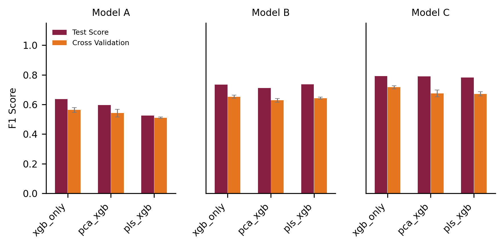
*Fig 7* (Made in [notebook #4.1](4.1_cross_validation_and_model_comparison.ipynb))

| Model | Architecture | CV Mean | CV Std | Test Score |
|-------|-------------|---------|--------|------------|
| A | xgb_only | 0.5628 | 0.0166 | 0.6362 |
| A | pca_xgb | 0.5417 | 0.0253 | 0.5955 |
| A | pls_xgb | 0.5106 | 0.0043 | 0.5243 |
| B | xgb_only | 0.6524 | 0.0110 | 0.7338 |
| B | pca_xgb | 0.6278 | 0.0124 | 0.7114 |
| B | pls_xgb | 0.6430 | 0.0073 | 0.7362 |
| C | xgb_only | 0.7159 | 0.0103 | 0.7915 |
| C | pca_xgb | 0.6750 | 0.0234 | 0.7892 |
| C | pls_xgb | 0.6713 | 0.0141 | 0.7821 |

XGBoost without dimensionality reduction achieved the highest overall scores across all models (Fig 7). Performance differences between pipelines were small, suggesting that PLS components make a good basis for interpretability and boost computational efficiency without a large sacrifice in accuracy.

Per-class performance on held-out data:

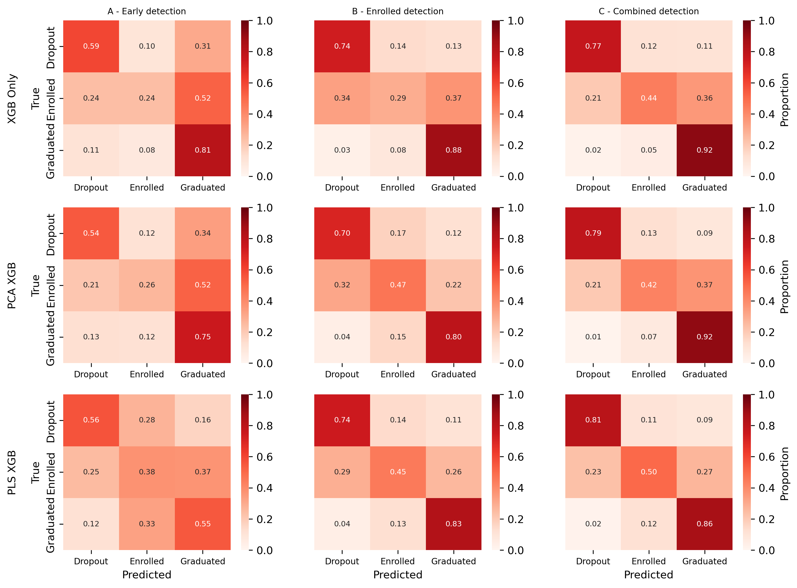
*Fig 8* (Made in [notebook #4.1](4.1_cross_validation_and_model_comparison.ipynb))

| Model | Architecture | Dropout F1 | Dropout Precision | Dropout Recall | Enrolled F1 | Enrolled Precision | Enrolled Recall | Graduate F1 | Graduate Precision | Graduate Recall |
|-------|-------------|-----------|------------------|---------------|------------|-------------------|----------------|------------|-------------------|----------------|
| A | pca_xgb | 0.600 | 0.544 | 0.669 | 0.288 | 0.265 | 0.315 | 0.686 | 0.754 | 0.629 |
| A | pls_xgb | 0.609 | 0.560 | 0.668 | 0.263 | 0.377 | 0.202 | 0.608 | 0.550 | 0.680 |
| A | xgb_only | 0.641 | 0.595 | 0.694 | 0.288 | 0.238 | 0.364 | 0.727 | 0.811 | 0.658 |
| B | pca_xgb | 0.726 | 0.704 | 0.750 | 0.415 | 0.466 | 0.374 | 0.819 | 0.800 | 0.838 |
| B | pls_xgb | 0.757 | 0.744 | 0.772 | 0.431 | 0.452 | 0.413 | 0.833 | 0.829 | 0.836 |
| B | xgb_only | 0.750 | 0.736 | 0.764 | 0.327 | 0.295 | 0.368 | 0.844 | 0.883 | 0.809 |
| C | pca_xgb | 0.823 | 0.787 | 0.862 | 0.453 | 0.425 | 0.484 | 0.872 | 0.915 | 0.833 |
| C | pls_xgb | 0.823 | 0.805 | 0.842 | 0.488 | 0.500 | 0.477 | 0.859 | 0.864 | 0.854 |
| C | xgb_only | 0.808 | 0.773 | 0.846 | 0.483 | 0.438 | 0.538 | 0.873 | 0.925 | 0.826 |

The most significant performance differences occur across models (A→B→C) rather than across pipeline architectures, confirming that variable availability timing and not architectural choice is the primary driver of predictive accuracy (Fig 8). The most important goal of these models is to detect students who may be at risk of dropping out in order to direct supportive intervention to those most in need. Below are the key findings for dropout detection specifically:

**Early detection (Model A):** xgb_only outperforms both dimensionality-reduced pipelines across all metrics; pls_xgb is marginally better than pca_xgb.
- F1: pca(0.60) < pls(0.61) < xgb(0.64)
- Precision: pca(0.54) < pls(0.56) < xgb(0.59)
- Recall: pca(0.67) ≈ pls(0.67) < xgb(0.69)

**Post-enrollment detection (Model B):** pls_xgb is the strongest performer by F1 and recall. Precision is similar between pls_xgb and xgb_only.
- F1: pca(0.72) < xgb(0.75) < pls(0.76)
- Precision: pca(0.70) < xgb(0.74) ≈ pls(0.74)
- Recall: pca(0.75) < xgb(0.76) < pls(0.77)

**Combined detection (Model C):** pca_xgb and pls_xgb both outperform xgb_only on F1 and precision; pca_xgb achieves higher recall and pls_xgb achieves higher precision.
- F1: xgb(0.80) < pca(0.82) ≈ pls(0.82)
- Precision: xgb(0.78) < pca(0.79) < pls(0.805)
- Recall: pls(0.84) < xgb(0.85) < pca(0.86)

**On the choice between PLS and PCA:** PLS is consistently at least as good as PCA for dropout detection and marginally better in Models A and B. In Model C the two are essentially equal on F1, with PLS favoring precision and PCA favoring recall. Critically, PLS typically achieves these results with far fewer dimensions than PCA (3 vs 40 for Model A and 13 vs 40 for Model C), yielding a reduction in computational complexity at very small cost to predictive accuracy.

## 7. Extended Estimator Comparison

To determine whether estimator choice affects performance, the comparison was extended to three estimators: XGBClassifier, LGBMClassifier, and a stacked model (XGB + LGBM → Logistic Regression). These were applied across all three pipeline categories and all three model categories, yielding 27 total configurations (Fig 9). No meaningful difference in F1-macro was observed across estimators within any pipeline or model category. This suggests that a predictive ceiling may have been reached; however, this would require further  testing to validate.

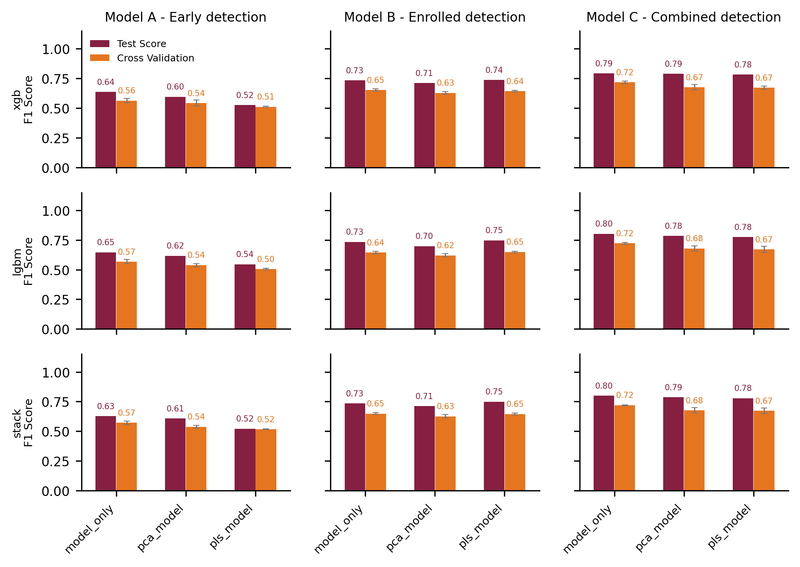
*Fig 9* (Made in [notebook #4.2](4.2_cross_validation_and_extended_model_comparison.ipynb))

## 8. Feature Attribution Analysis
To understand which predictor variables drive target classification in each model, a multistep analysis was performed on the PLS pipeline architectures:

1) XGBoost feature importances `xgb.feature_importances_` were used to rank PLS components by their contribution to classification. This step is particularly important because, unlike PCA components which are ordered by variance explained, PLS components are not sorted. The top 3 components by XGBoost importance were selected for further analysis.

2) The PLS model was extracted from the pipeline and refit using a one-hot encoded target matrix (shape: n_samples × 3). This was necessary to obtain y_loadings_ with the correct shape (n_targets = 3, n_components). This process yields an identical fit and enables interpretation of how each component relates to each target class.

3) For each of the top 3 components, feature loadings `pls.x_rotations_` were sorted by absolute value from highest to lowest and mapped back to their original variable names. This matrix quantifies how much each input feature contributes to each component. Note: x_rotations was used instead of x_weights because of how the coefficients applied to the independent variables are computed in the scikit-learn source code: 
    ```
    self.coef_ = np.dot(self.x_rotations_, self.y_loadings_.T)
    self.coef_ = (self.coef_ * self._y_std).T / self._x_std
    ```
    The x_rotations are nearly identical to the x_weights, but correct for distortions across deflation steps in the NIPALS algorithm used in PLSRegression.

4) The corresponding `y_loadings_` were extracted for each of the top 3 components, quantifying how strongly each component reconstructs each target class.

All of these steps are handled within a Python script: `feature_attribution.py`, which uses `ModelConstructor` objects to extract the necessary variables for running the feature attribution analysis. 

Bar plots were produced showing feature loadings onto each of the top 3 components for each model, with inset plots showing the corresponding target class loadings (Coef) (Fig 10-12). Together, these visualizations reveal which original variables are most important for each component, and how each component relates to the prediction of each outcome class. IE: If a component loads positively onto a target class and a feature loads positively on the component, then the feature is positively associated with the class.

### 8.2. Feature Attribution Analysis - Notable findings

Model A: Early Detection

The three most predictive PLS components in Model A encode distinct discriminative axes across the target classes. The first component separates dropouts from graduates, the second distinguishes graduates from the remaining classes, the third separates dropouts from enrolled students. Together they form a complementary set of decision boundaries across all three target classes (Fig. 10). 

Financial indicators are the most consistent predictors across these components. Being up to date on tuition fees and holding a scholarship are positively associated with graduation and enrollment, and negatively associated with dropout. Higher pre-enrollment grades are also positively associated with graduation. Age at enrollment is also positively associated with dropout, consistent with the broader literature on non-traditional student risk [ref](https://www.researchgate.net/publication/332953886_Services_and_support_for_nontraditional_students_in_higher_education_A_historical_literature_review).

Notably, two degree programs, Nursing and Social Service, are positively associated with graduation. Both involve professional service to others, suggesting that students driven by prosocial motivation may be more likely to complete their degrees.

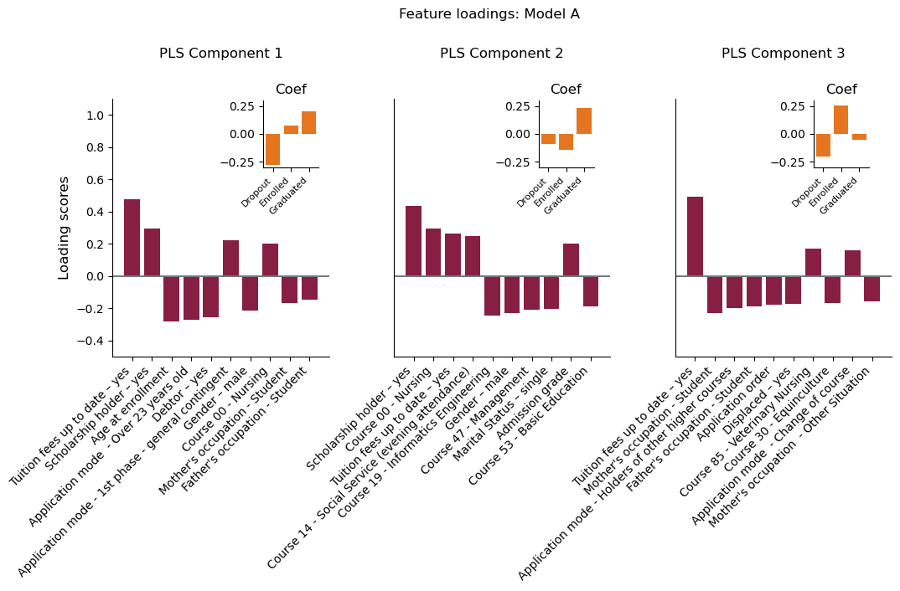
*Fig 10* (Made in [notebook #5](5_feature_attribution.ipynb))

Model B: Post-Enrollment Detection

The first component again separates dropouts from graduates via academic performance, with higher grades and approved credits strongly positively associated with graduation. The second PLS component is more nuanced: higher evaluation scores are negatively associated with graduates while higher credits approved/enrolled are positively associated with graduates, suggesting that students who enroll in many courses but underperform are likely to still succeed but may struggle to graduate. The third component reinforces this, showing that higher credited and enrolled units are positively associated with dropout, suggesting that overenrollment is a dropout risk factor independent of grade performance (Fig. 11). 

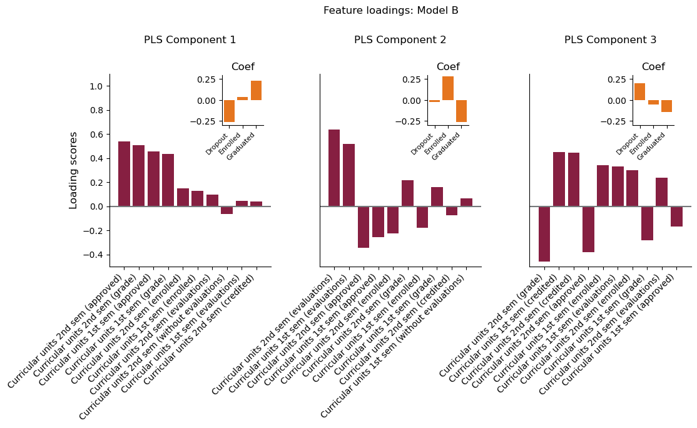
*Fig 11* (Made in [notebook #5](5_feature_attribution.ipynb))

Model C — Combined Detection

The combined model's first component reflects the findings of Models A and B: a combination of financial and academic indicators jointly discriminates graduates from dropouts. The second component is mainly dominated by semester evaluation counts. This component also shows a moderate positive association between enrollment in Informatics Engineering and graduation and a moderate negative association between scholarship holder status and enrollment, consistent with scholarship holders being a minority population. The third component reveals that weak financial indicators are positively associated with dropout alongside being single and being displaced. This suggests that social stressors (IE: financial instability, housing instability, and lack of personal support networks) may contribute independently to dropout risk beyond academic and financial factors (Fig. 12).

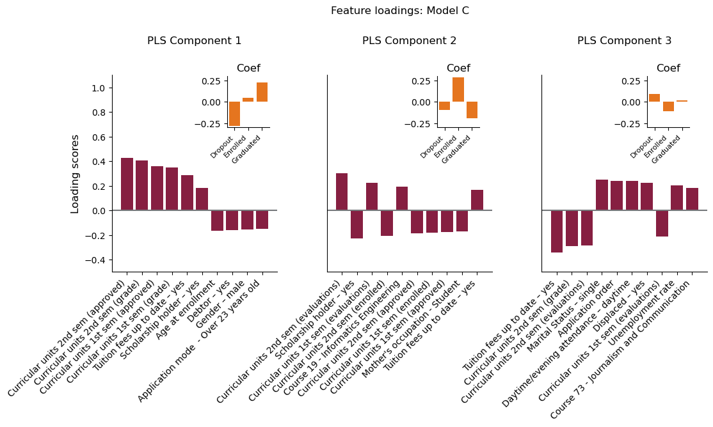
*Fig 12* (Made in [notebook #5](5_feature_attribution.ipynb))


## Methodological Disclaimer and Future Work

Several elements of this project are exploratory and are not intended to represent finalized or fully validated methodological choices; therefore they should be interpreted with caution. In particular, PLSDA was approximated using PLSRegression with one-hot encoded targets rather than an objective optimized for classification, and component selection was performed without fully nested cross-validation. Furthermore, the use of SMOTE prior to dimensionality reduction may distort feature space geometry, and feature attribution based on PLS loadings combined with tree-based importance is not guaranteed to be stable. Comparisons between pipelines are also currently based on point estimates alone. Future work will address these limitations by implementing conventional PLSDA, using nested cross-validation, evaluating alternative resampling strategies, and applying more standard interpretability methods (e.g., VIP, SHAP). Additionally rigorous statistical comparisons between models CV performance will be performed. Based on the distribution of paired differences, either a paired t-test or Wilcoxon signed-rank test will be done on the per-fold CV scores.

The enrolled student population is a subset of the data that is temporally censored; these samples have not exhibited a terminal outcome (dropout/graduated). This presents an opportunity to expand upon the findings by implementing survival analysis on this intermediate subset for time-to-event modeling. Furthermore, factor analysis will be explored as an alternative dimensionality reduction method to assess whether it can extract more interpretable latent dimensions. 
